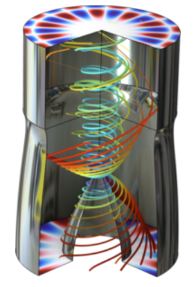
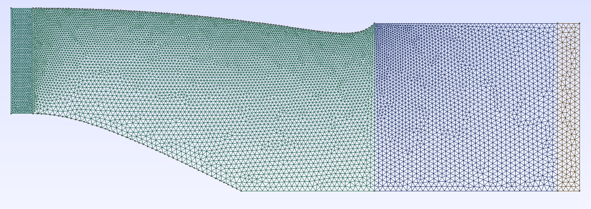

### 基于NVIDIA cuDSS库解决稀疏线性代数方程组

#### 引言
NVIDIA提供的CUDA Sparse Solver（cuDSS）库，是一种高性能的稀疏线性方程组求解方法，可广泛应用于科学计算和工程模拟。由于频域声学方程用到大规模复数方程组的求解，我也在最近将cuDSS接入了有限元求解器中，以支持复数方程组求解。本文基于[`simple.cpp`示例代码](https://github.com/NVIDIA/CUDALibrarySamples/blob/main/cuDSS/simple/simple.cpp)，展示如何利用cuDSS解决一个对称正定稀疏矩阵问题，深入探讨其工作流和实现细节。同时将实际的一个求解频域对流波动方程的真实case做用cuDSS求解与用传统petsc求解器的比较。

---

#### 示例背景
cuDSS主要用于求解如下形式的稀疏线性方程组：
```
Ax = b
```
其中：
- `A` 是稀疏矩阵；
- `x` 是未知的目标解（向量或矩阵）；
- `b` 是右侧向量（或矩阵）。

在示例中，`A`是一个5x5的对称正定（Symmetric Positive-Definite, SPD）矩阵，已被优化为稀疏矩阵格式，并使用CSR（Compressed Sparse Row，压缩稀疏行）存储。

---

#### 程序实施详解

**1. 主机内存分配与初始化**
程序首先通过`malloc`动态分配三组主机内存用于存储CSR格式矩阵的数据：
1. **行偏移数组（`csr_offsets_h`）**: 定义每行中非零元素的起始位置。
   ```c
   csr_offsets_h = [0, 2, 4, 6, 7, 8];
   ```

2. **列索引数组（`csr_columns_h`）**: 每个非零元素的列号。
   ```c
   csr_columns_h = [0, 2, 1, 2, 2, 4, 3, 4];
   ```

3. **非零值数组（`csr_values_h`）**: 矩阵的实际非零值。
   ```c
   csr_values_h = [4.0, 1.0, 3.0, 2.0, 5.0, 1.0, 1.0, 2.0];
   ```

向量`b`初始化为理论解，确保验证输出正确：
```c
b_values_h = [7.0, 12.0, 25.0, 4.0, 13.0];
```

**2. 数据传输至GPU**
主机初始化完成后，将数据复制到GPU显存：
- 使用`cudaMalloc`申请设备内存；
- 用`cudaMemcpy`将前述`csr_offsets_h`、`csr_columns_h` 和`csr_values_h`等数据从主机传输至设备。

此外，通过创建CUDA流（`cudaStream_t`）允许相关操作异步执行，优化计算性能。

---

**3. cuDSS库的求解步骤**
cuDSS求解程序主要分为三个阶段：

**（1）符号分析**
通过调用`cudssExecute`函数，以`CUDSS_PHASE_ANALYSIS`阶段执行符号因式分解。符号分解确定稀疏结构的存储模式及计算过程，特别是矩阵的对称属性与非零分布。

**（2）数值因式分解**
数值因式分解是求解中最重要的一步，使用`CUDSS_PHASE_FACTORIZATION`提取矩阵的稀疏三角因式，以此优化求解的复杂度。

**（3）求解阶段**
在稀疏三角因式分解的基础上，`CUDSS_PHASE_SOLVE`完成了对稀疏线性系统的解算，并直接将结果存储到显存的解向量中。

---

**4. 结果验证与打印**
计算完成后，将求解结果从设备端拷回主机内存，并进行误差验证。结果示例如下：
```
x[0] = 1.0000 expected 1.0000
x[1] = 2.0000 expected 2.0000
x[2] = 3.0000 expected 3.0000
x[3] = 4.0000 expected 4.0000
x[4] = 5.0000 expected 5.0000
```
若计算结果与理论值误差在`2e-15`以内，输出`PASSED`，否则输出`FAILED`。

---

**5. 对象销毁与内存管理**
为了避免出现内存泄漏，程序通过以下步骤逐步释放内存：
1. 调用宏`CUDSS_EXAMPLE_FREE`释放主机与设备端CSR矩阵及向量内存；
2. 销毁CUDA流；
3. 调用`cudssDestroy`清理cuDSS句柄；
4. 清理所有数据对象和配置对象。

---

#### 程序关键代码段
以下展示了程序中的一些核心实现代码：

**内存分配及数据拷贝**
```cpp
CUDA_CALL_AND_CHECK(cudaMalloc(&csr_offsets_d, (n + 1) * sizeof(int)),
                    "cudaMalloc for csr_offsets");
CUDA_CALL_AND_CHECK(cudaMemcpy(csr_offsets_d, csr_offsets_h, (n + 1) * sizeof(int),
                    cudaMemcpyHostToDevice), "cudaMemcpy for csr_offsets");
```

**解算的cuDSS执行阶段**
```cpp
CUDSS_CALL_AND_CHECK(cudssExecute(handle, CUDSS_PHASE_ANALYSIS, solverConfig, solverData,
                                  A, x, b), status, "Analysis");
CUDSS_CALL_AND_CHECK(cudssExecute(handle, CUDSS_PHASE_FACTORIZATION, solverConfig, solverData,
                                  A, x, b), status, "Factorization");
CUDSS_CALL_AND_CHECK(cudssExecute(handle, CUDSS_PHASE_SOLVE, solverConfig, solverData,
                                  A, x, b), status, "Solve");
```

**结果验证与输出**
```cpp
for (int i = 0; i < n; i++) {
    printf("x[%d] = %1.4f expected %1.4f\n", i, x_values_h[i], double(i + 1));
    if (fabs(x_values_h[i] - (i + 1)) > 2.e-15)
        passed = 0;
}
```

---

#### 程序优势与扩展
1. **模块化设计**  
在错误处理与资源管理上，程序通过宏定义显著提升了代码可读性和复用性（如`CUDA_CALL_AND_CHECK`、`CUDSS_EXAMPLE_FREE`）。

2. **扩展性强**  
cuDSS库支持多种矩阵存储格式（如COO、CSR、CSC）及多种矩阵类型（如非对称、对称等），用户可轻松调整示例中的CSR稀疏矩阵为更复杂的稀疏系统。

3. **性能优化**  
得益于CUDA流和cuDSS的异步设计，主机和设备端的任务调度高效且性能稳定。

---

#### 总结
示例`simple.cpp`充分演示了如何利用NVIDIA cuDSS库实现高效的稀疏矩阵求解。程序设计条理清晰、接口调用逻辑明确，为用户快速掌握cuDSS的基本用法提供了良好参考。对于科学计算与工业应用中的大型稀疏线性系统，该方案表现出显著的性能优势。

用户可以在此基础上，自行扩展为更复杂的应用场景，包括动态矩阵生成、多矩阵并行求解等，以充分挖掘GPU资源的潜能。

---

#### 真实case对比

由于我在做有限元开发爱好中会用到复数方程组的求解，在GPU计算大行其道的今天，将cuDSS集成进有限元求解器是有必有的。接入后，使用求解器计算了一个与comsol一致的[case](https://cn.comsol.com/model/flow-duct-1371)



我的网格单元数为19000左右三角单元，但是阶次为4阶，所以自由度数目来到了151298。

下面直接给出使用petsc求解与使用cudss求解的对比结果

1. 我使用的是nvidia 2070S GPU与intel 10700K CPU，这款GPU双精度算力并不高，给出了GPU的单精度与双精度的求解结果
1. 使用cuDSS的求解耗时包含了显存分配/复制数据/GPU计算的总时间(见下面截图)

|求解器|求解时间(ms)|加速比|
|--|--|--|
|petsc|5081.88|1|
|cuDSS单精度|613.924|8.277|
|cuDSS双精度|736.487|6.90|

各个分项的耗时统计如下图：


可以看出，用双精度和单精度的误差还是差了好几个数量级的，但是都不影响结果的计算，单精度的计算一般也能满足要求。

cuDSS加速比还是非常明显的，在双精度下依然达到了7倍左右，这是一个端到端的加速，经过加速，在此真实case下，有限元问题的求解过程的耗时由由原来矩阵组装与求解的1：1变为约1：0.15，即大型方程组求解不是主要瓶颈，而是矩阵组装过程了。关于这个case我后面会专门写一篇博客来与comsol做对比。
